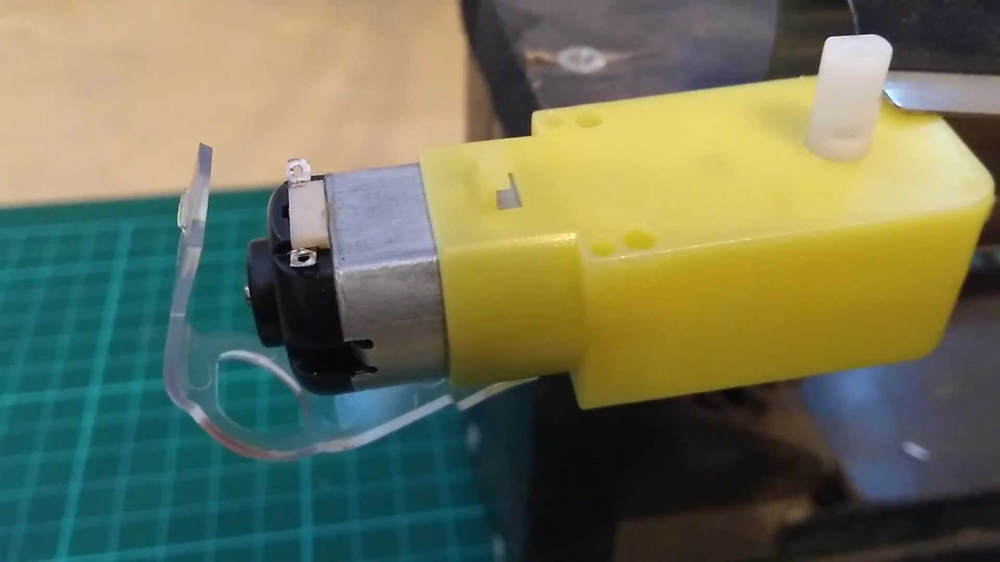
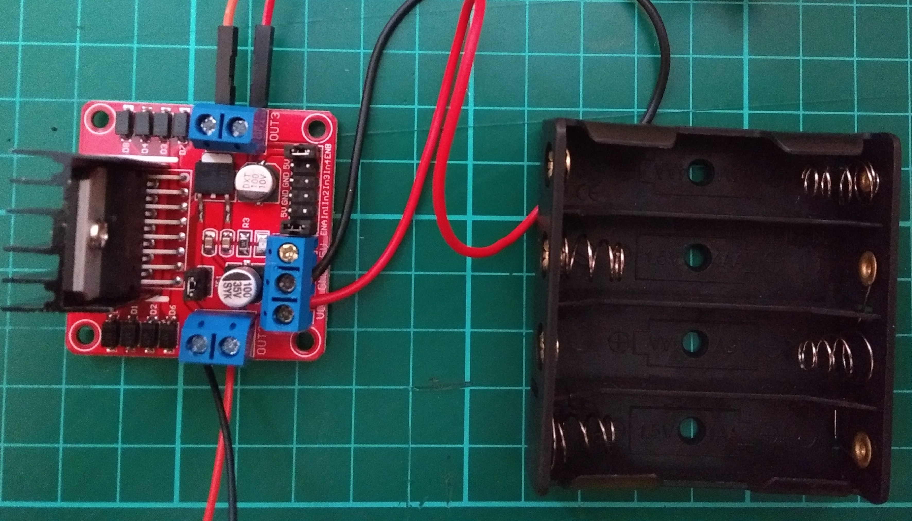
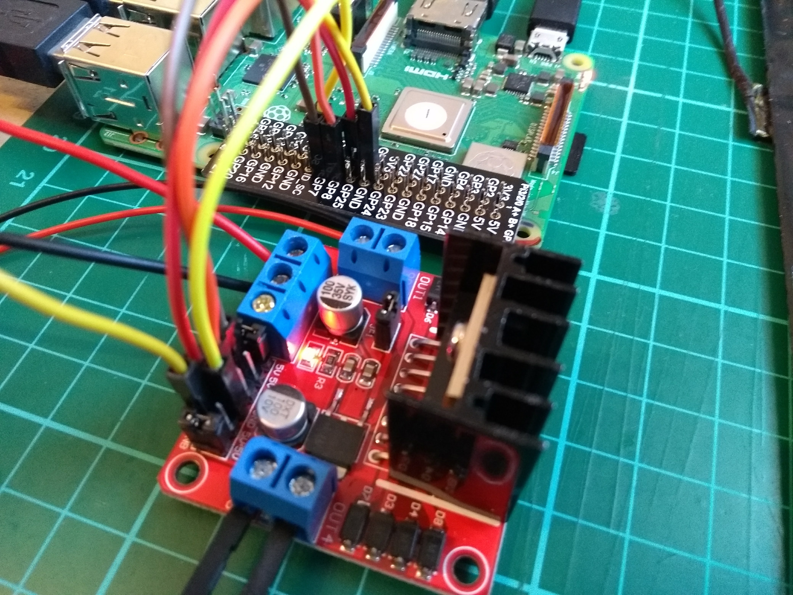

## Assembling the motors and board

The first thing you will want to do is to connect your motor controller board to your Raspberry Pi, the battery pack and your two motors, to test that they are all working.
The instructions here are for L298N Dual H Bridge DC Stepper Motor Driver Controller Board, however they will be pretty similar for most motor controller boards, but you should consult the documentation for your board, if you are using a different one.

### Soldering wires to your motors

Most motors, when purchased, come without soldered wires, so you will need to add these on. If you have never soldered before, then you might like to have a look at out [Getting Started with Soldering](https://projects.raspberrypi.org/en/projects/getting-started-with-soldering)

--- task ---
Strip the ends of the wires, to reveal the metal core.

	
--- /task ---

--- task ---
Remove the plastic clip from the motor, to make soldering to the contacts easier.

--- /task ---

--- task ---
Solder the wires to each of the terminals on the motor. It doesn't matter which wire goes to which terminal.

--- /task ---

### Connect the motors to the board

You will need to connect the motors to the board. For this you will require a small screwdriver.

--- task ---
Using a screwdriver, loosen the screws in the terminal blocks labeled `OUT1`, `OUT2`, `OUT3` and `OUT4`. Have a look at the documentation for your board if your labels are different. Insert the stripped ends of wire into the terminal blocks.

--- /task ---

--- task ---
Tighten the screws up, so that the wires are held firmly in the terminal blocks

--- /task ---

### Powering the motors

The motors require more power than the Raspberry Pi could provide. For this reason you use 4 AA batteries to power the motors.

--- task ---
Loosen the screws in the terminal block labeled `VCC`, `GND` and `5V`. Take the AA battery holder and insert the red wire into the terminal block labeled `VCC`. The black wire goes into the block labeled `GND`. It is important that you get this the correct way around.

--- /task ---

--- task ---
Tighten the screws so that the wires are held firmly in place.

--- /task ---

### Connecting the board to your Raspberry Pi

The board used in this project needs to be wired to the Raspberry Pi. Other boards may bary in how they are connected, and some can simply be placed onto the Raspberry Pi GPIO pins as a hat. Make sure you look at the documentation for your board if this is the case.

On the board used here there are pins labeled `In1`, `In2`, `In3` and `In4`, as well as 2 `GND` pins. Which GPIO pins on your Pi that you use is up to you, but for the purposes of this project GPIO pins `7`, `8`, `9` and `10` have been used.

--- task ---
Using five female-female jumper leads connect up the Raspberry Pi GPIO pins to the pins on the motor controller board.
|GPIO Pin|Board Pin|
|--------|---------|
|`7`|`In1`|
|`8`|`In2`|
|`9`|`In3`|
|`10`|`In4`|
|`GND`|`GND`|

--- /task ---
