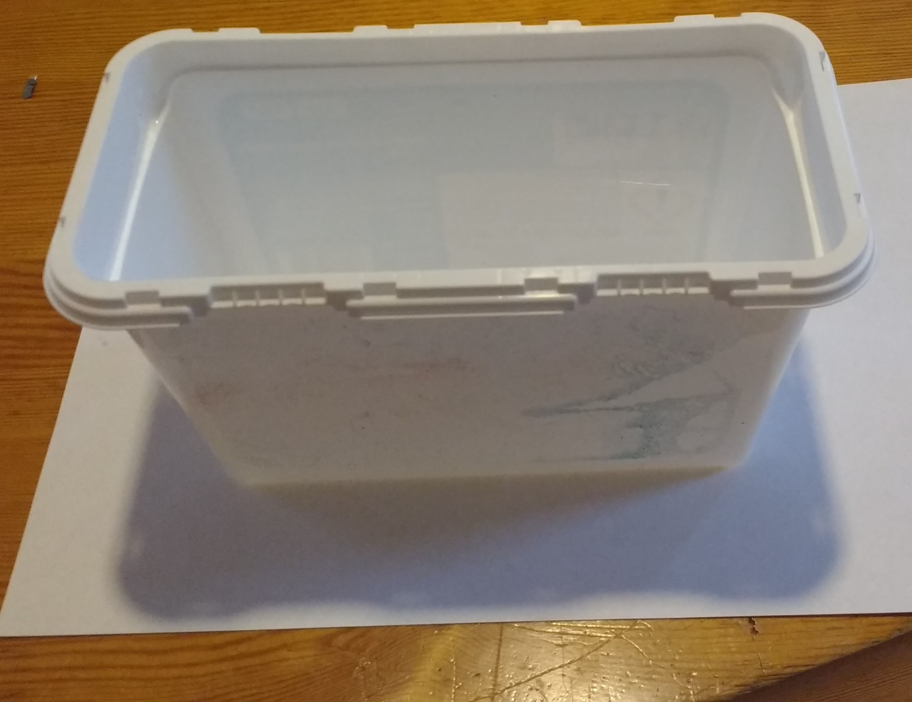
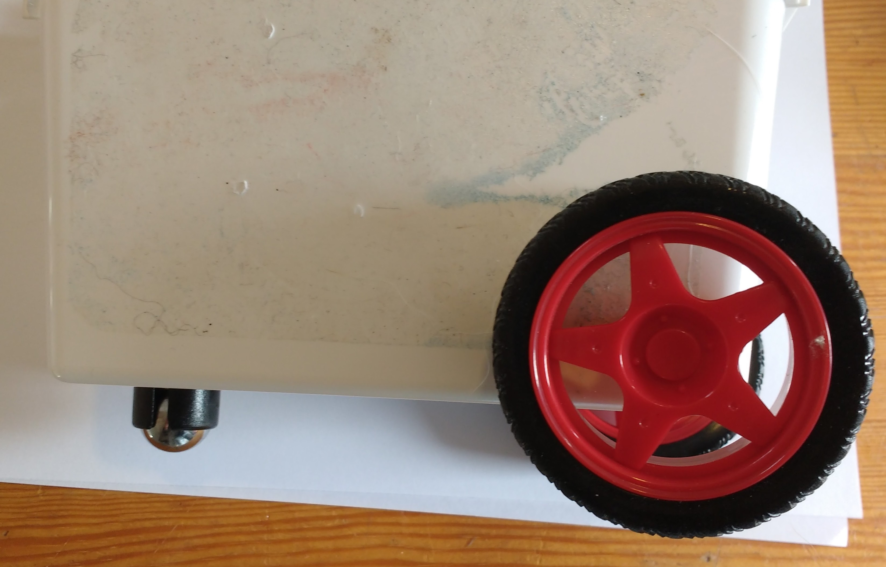
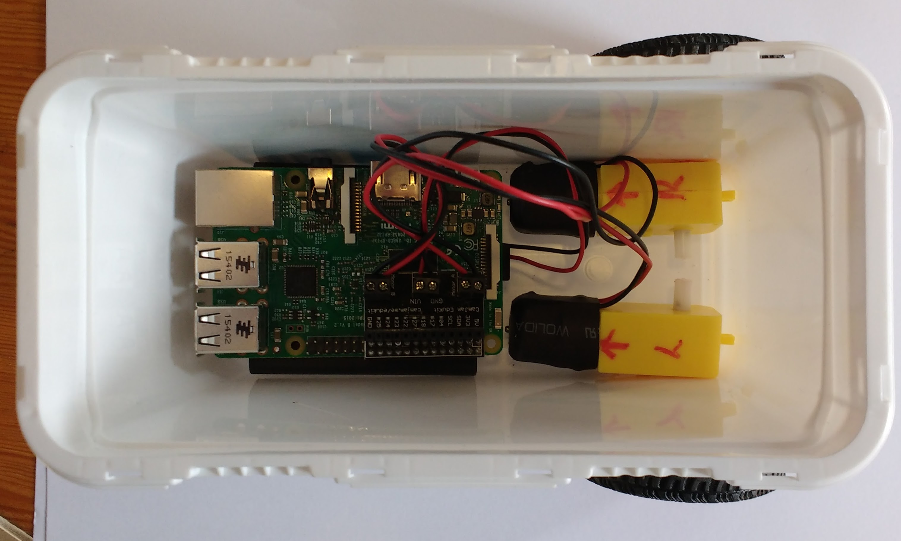

## Assemble your robot

There is no *right* way to build your robot chasis, but there are a few things to bare in mind:

- The chasis needs to house the Raspberry Pi and motor controller.
- The chasis needs to also carry the batteries for the motor controller and the Raspberry Pi.
- The chasis needs to allow the mounting of a pair of wheels, the line sensor and the ultrasonic distance sensor.

In this example a washing poweder tub was used, but the instructions can easily be adapted to any type of container or even a monstorus Lego construction.

- The first step is to place your motors into the chasis. 

	
	
- Here, two holes have been cut into the container to allow the motor axels to pass through. 

	

- Make sure you remember which is the right motor and which is the left. The motors are held in place with a little blutac. Remember that this is just the prototype, so you don't want to be glueing anything together just yet.

	

- Now the wheels can be attached.

	

- With the wheels in place a ball castor can be screwed to the front of the container to act as a thrid wheel. If you don't have a ball castor you could use another set of wheels or anything that's going to provide as little friction as possible. Maybe a ping-pong ball that has been cut in half, for instance.

	

- The next stage is to wire up the motors to the Raspberry Pi.

	

- Next you can power your Raspberry Pi using a power brick. At this stage, you're probably going to want to connect to the Raspberry Pi remotely. You can do this via SSH or VNC.

[[[rpi-ssh-access]]]
[[[rpi-vnc-access]]]

